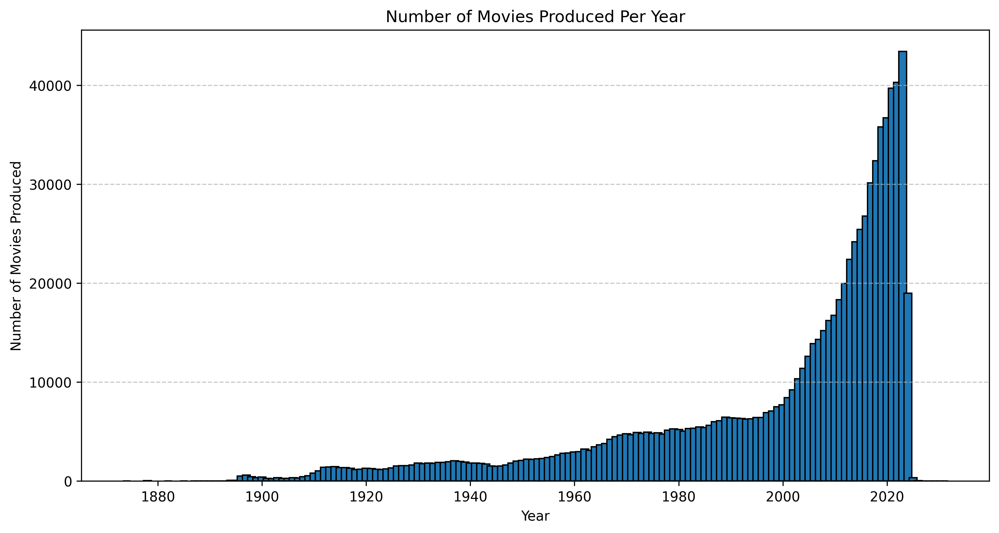

# Exploration and Cleaning

In my initial proposal, I aimed to examine how various factors influence movie ratings by identifying trends across different groups of films, such as those categorized by actors, genres, or countries. However, I didn’t realize how many entries for movies were missing ratings in the dataset.

## ** Movie Entries Missing Rating: 90.34% **

Due to this, I decided to change my initial proposal from focusing on ratings to focusing on trends of the most-produced movie genres.

I started by looking at the amount of movies produced per year. I realized that the dataset included movies released from 1874 to 2031. When looking at the histogram of movies over time, I was able to confirm that the dataset provides a consistent and comprehensive distribution of movies across decades, ensuring that there is enough data to analyze trends in genre popularity over time.

## ** Examples of Genres **

### ('War',)

### ('Drama',)

### ('TV Movie',)

## ** Examples of Themes **

### ('Legendary musicians and stardom',)

### ('Dreamlike, quirky, and surreal storytelling',)

### ('Graphic violence and brutal revenge',)

From then I looked at the genres and themes provided in the datasets. Upon comparison, I found that themes were much more specific, while genres provided broader categorizations. Given this, I decided to use genres as my primary method for grouping movies by type.

## ** Date Missing From 0.00% of Entries **

## ** Country Missing From 0.00% of Entries **

## ** Release Type Missing From 0.00% of Entries **

## ** Age Rating Missing From 0.00% of Entries **

After confirming that all entries have complete release date information, I proceeded to evaluate the consistency of data across key attributes, including country, release type, and age rating. These attributes could also be useful for identifying meaningful groupings of movies. With this I was confident that my data was clean and thorough enough to explore my hypothesis.
